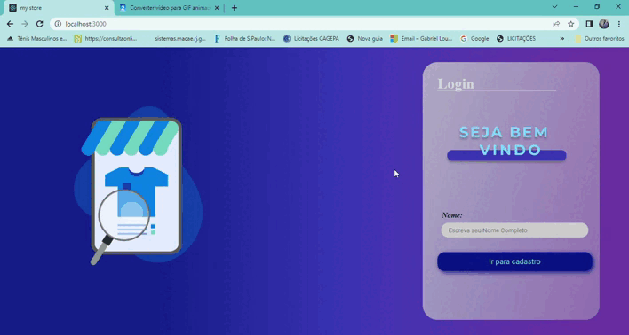

# Sistema de cadastro

> Projeto finalizado 
 

## 💻 Sobre o Projeto

Este projeto trata-se de uma aplicação de cadastro de produtos, onde há umna pagina de identificação, uma de cadastro de pedidos e uma de listagem de pedidos, inclui ainda um modal para os itens favoritos! 

- [X] Você pode excluir, editar e favoritar os produtos cadastrados! 
- [X] Uma vez logado você pode acessar as paginas, caso não esteja logado não conseguira!
- [X] Todos os inputs são obrigatórios e contem validações!
- [X] Todos produtos tem historico de criação e atualização, mostrado na pagina de listagem!
- [X] Contem informações de quem criou ou alterou o produtos!
- [X] Aplicação com responsividade!
- [X] Opção de logout!

utilizei as ferramentas: React.js, typescript, Axios, mockApi, react-router-dom, react-modal, Styled-componentes..

 

## 👨‍💻Link para acesso: 
<a href="https://my-store-products.netlify.app/">Aperte aqui ⬅ </a>

## ☕ tecnologias utilizadas

 

## 🤝 Colaborador

<table>
  <tr>
    <td align="center">
      <a href="#">
         
        
          <a >Gabriel Ibiapino</a>
        
      </a>
    </td>
  </tr>
</table>

  

 

[⬆ Voltar ao topo](#Sistema-de-cadastro) 